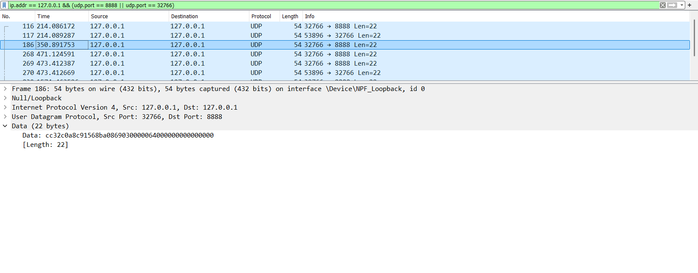
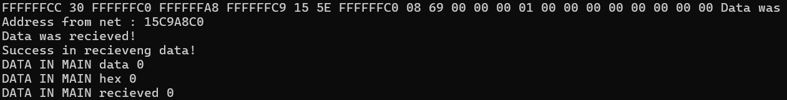
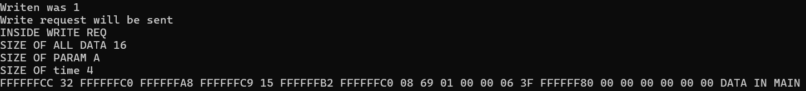

# CONTROL CONSTANTS OVER UDP 
## RUS VERSION DESCRIPTION
Программный модуль ControlConstantsOverUdp используется для общения с устройствами в сети посредством UDP пакетов.
В данном программном модуле важно составлять request_t только через специальные методы модуля make_read_request и make_write_request.
Отправка сформированного request_t осуществляется посредством метода do_request в качестве парметра выступают макрос, который определит
чтение или запись и сам сформированный request_t. Возвращает функция request_t статус выполнения функции, в параметре который мы передавали по указателю
request_t будет содерджаться данные из устройства при успешном выполнении.

Внутри класса существует поток постоянно работающий на вход. Функция thread_recieve_data. При деструкторе поток выключается в других случаях, ОС закроет 
поток сама. Чтобы получить объект, с помщью которго можно управлять модулем нужно вызвать функцию get_ControlConstants.
Модуль был проверен с помощью python скрипта имитирующем работу устройства. Адрес использовался локальный. Порты использовались разные тк компьютер один.

В build/bin лежат бинарники
Чтобы собрать проект необходимо создать внутри protocol build
Затем cmake -S . -B build проинициализировать проект
cmake --build build --config=Release или Debug чтобы собрать проект
## ENG VERSION DESCRIPTION
Program module ControlConstantsOverUdp is used for communication with devices in network via UDP datagramms.
The module consists two files .h where classes are described and .cpp where functions and methods are implemented.
Below is the struct of request represented and brief description of each value. 
|Header|devId|Unix TimeStamp|Packet number|Param|
|-|--------|---|---|---|
|2 bytes|4 bytes|4 bytes|2 bytes|10 bytes|
|Describes name of protocol, version and type of request:read, answer, write|IP address of device|Timestamp|Number of packet to track packets| In this field data is stored|

It is a __Param__ description below. 
|Address|DATA|
|-|--------|
|2 bytes|8 bytes|
|Address inside device where to write or read data|READ req: data must be zeroes and in answer request here will be data from address WRITE req: data that wiil be written to a ceratin address |

> [!NOTE]
> Writing to protected addresses can cause frizzing device.
> Data that can be in double type of data.

### How to use:
To send a request it is necessary to create and fill request_t through special methods __"make_read_request"__ and __"make_write_request"__
Sending this request is possible through method "do_request" params are MACRO which defines __READING__ or __WRITING__ and request_t that was created and initialized.
"do_request" returns status of performing function, in request_t that was passed as param, will be new data in case of READING request 

There is a reciever thread inside class "thread_recieve_data". There are special methods for opening this thread and closing it __"stop_socket_and_thread"__ and __"enable_socket_and_thread"__.

__"enable_socket_and_thread"__ is private method that are called when func "get_ControlConstants" called. 

build/bin contains executable code

- __To build a workplace__
1. To make project there is a need to make dir /build in /protocol `mkdir build`
2. `cmake -S . -B build` to init project
3. `cmake --build build --config=Release or Debug` to build project and to get executable

### SIMULATE
To simulate a working device "main.py" is used. There are two address where data can be written through WRITE request and can be read through READ request.

### RESULTS

Here are the results of requests that can be seen in wireshark.

Here is the first read request.

Here is the first write request.

Here is the second read request.

